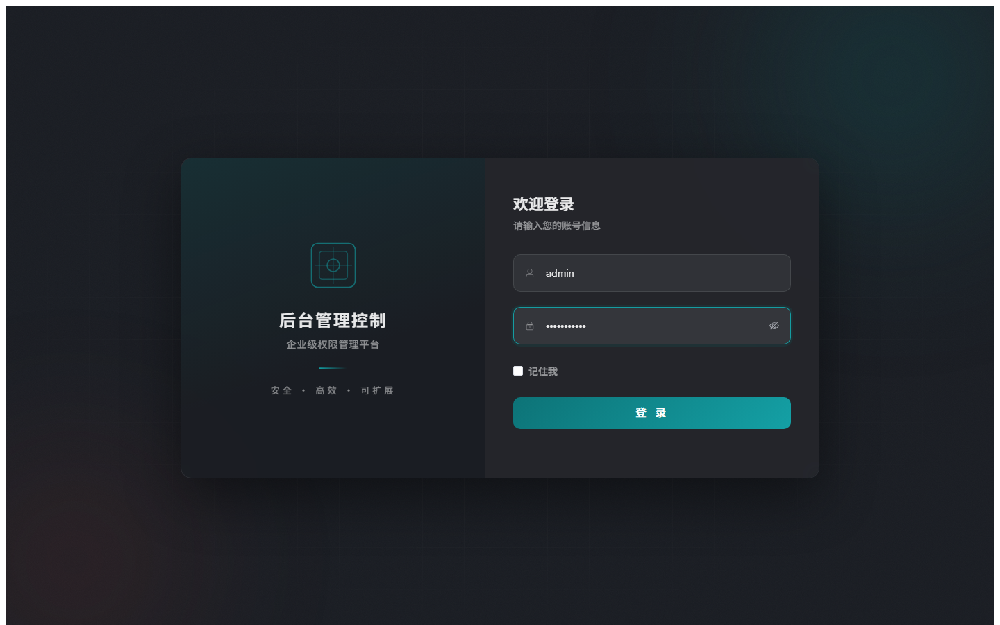
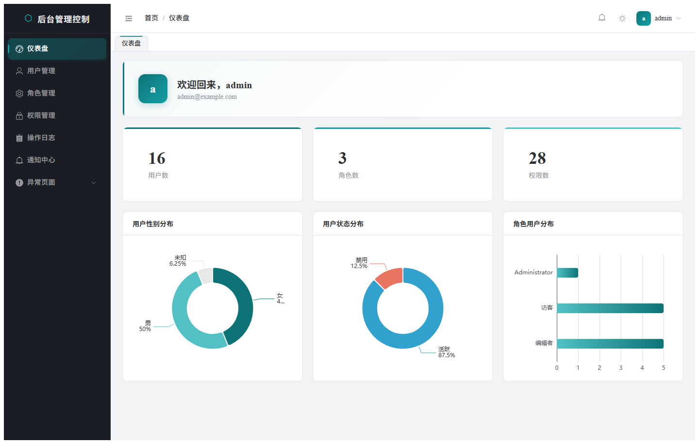
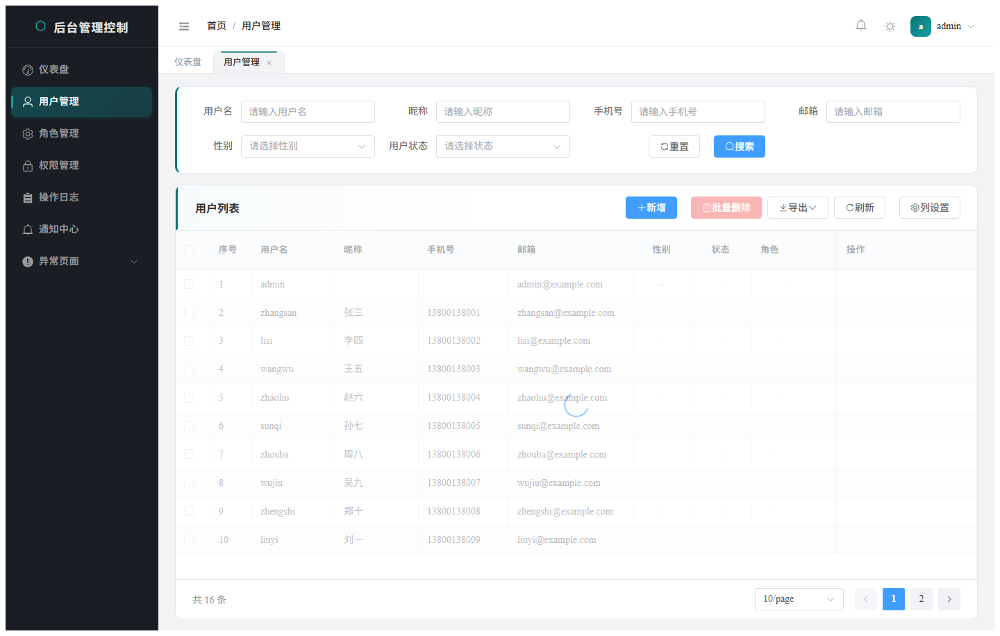
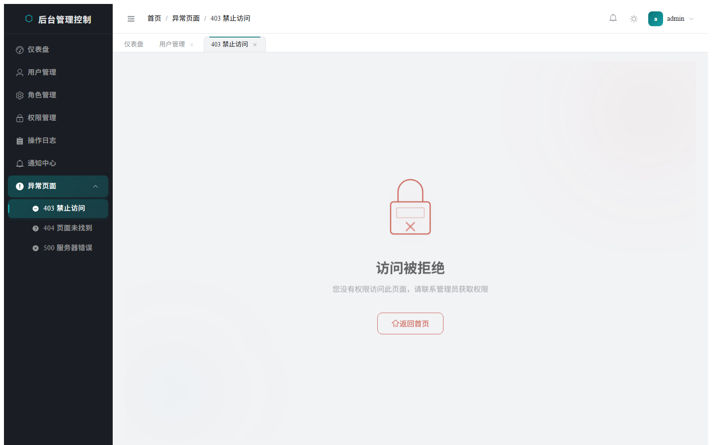
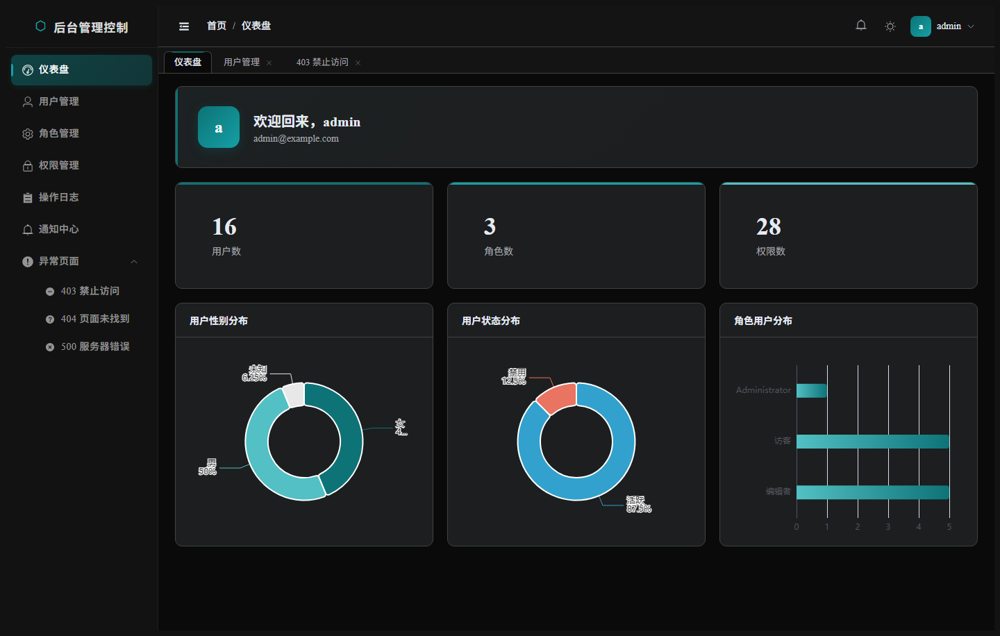

# 后台管理控制

企业级权限管理后台，提供用户管理、角色权限、通知中心、操作审计等完整功能。前端基于 Vue 3 + Element Plus，后端基于 Gin + PostgreSQL + Redis。

## 技术栈

| 前端 | 后端 |
|------|------|
| Vue 3 + TypeScript | Go + Gin |
| Vite 8 | GORM + PostgreSQL |
| Element Plus | Redis + Casbin RBAC |
| Pinia 状态管理 | JWT 身份认证 |
| Vue Router 4 | Zap 日志 + Swagger |
| ECharts 图表 | Docker Compose |

## 截图

<table>
  <tr>
    <td></td>
    <td></td>
  </tr>
  <tr>
    <td align="center">登录页</td>
    <td align="center">仪表盘</td>
  </tr>
  <tr>
    <td></td>
    <td></td>
  </tr>
  <tr>
    <td align="center">用户管理</td>
    <td align="center">异常页面</td>
  </tr>
  <tr>
    <td colspan="2"></td>
  </tr>
  <tr>
    <td colspan="2" align="center">暗黑模式</td>
  </tr>
</table>

## 功能特性

- **身份认证** — 登录/登出，JWT Token 鉴权，记住我
- **仪表盘** — 统计概览卡片 + 图表（性别分布、状态分布、角色用户分布）
- **用户管理** — 多条件搜索、新增/编辑/删除、批量删除、分配角色、列设置、CSV/XLSX 导出
- **角色管理** — 角色 CRUD、分配权限、批量删除
- **权限管理** — 权限 CRUD、批量删除
- **操作审计** — 操作日志列表与详情
- **通知中心** — 通知列表、未读计数、标记已读、全部已读、发送通知
- **异常页面** — 403/404/500 错误页
- **个人中心** — 头像上传、资料编辑、修改密码
- **标签导航** — 多标签页切换、右键菜单（关闭当前/关闭其他/关闭全部）、页面缓存
- **暗黑模式** — 一键切换亮色/暗黑主题，持久化偏好
- **权限体系** — 路由级权限（动态路由过滤） + 按钮级权限（v-permission 指令）
- **侧边栏** — 可折叠、子菜单分组
- **页面过渡** — 路由切换淡入淡出动画

## 快速开始

### 前置条件

- Node.js >= 20
- Go >= 1.21
- Docker & Docker Compose（PostgreSQL + Redis）

### 启动后端

```bash
# 启动 PostgreSQL 和 Redis
cd backend && docker compose up -d

# 启动 API 服务（默认 :8080）
go run ./cmd/server --config configs/config.yaml
```

### 启动前端

```bash
cd frontend
npm install
npm run dev
```

默认访问 http://localhost:5173

### 默认账号

| 用户名 | 密码 | 角色 |
|--------|------|------|
| admin | admin123456 | 超级管理员（全部权限） |

> 生产环境请修改 `jwt.secret` 和默认密码。

## 项目结构

```
├── frontend/                 # 前端（Vue 3 + TypeScript）
│   ├── src/
│   │   ├── api/              # API 接口层
│   │   ├── components/       # 公共组件（侧边栏、顶栏、标签栏）
│   │   ├── layouts/          # 布局组件
│   │   ├── router/           # 路由配置与守卫
│   │   ├── stores/           # Pinia 状态管理
│   │   ├── types/            # TypeScript 类型
│   │   ├── utils/            # 工具函数
│   │   └── views/            # 页面视图
│   └── ...
├── backend/                  # 后端（Go + Gin）
│   ├── cmd/server/           # 入口
│   ├── configs/              # 配置文件
│   ├── internal/
│   │   ├── bootstrap/        # 应用初始化
│   │   ├── config/           # 配置加载
│   │   ├── middleware/       # 中间件（认证、鉴权、限流、日志）
│   │   ├── modules/          # 业务模块（auth、rbac、audit、notification、dashboard）
│   │   ├── pkg/              # 公共包（response、security、cache、logger）
│   │   └── router/           # 路由注册
│   └── ...
└── scripts/                  # 辅助脚本
```

## API 概述

### 认证

| 方法 | 路径 | 说明 |
|------|------|------|
| POST | /api/v1/auth/login | 登录 |
| GET | /api/v1/auth/me | 当前用户信息 |

### 用户管理

| 方法 | 路径 | 说明 |
|------|------|------|
| GET | /api/v1/users | 用户列表 |
| POST | /api/v1/users | 创建用户 |
| GET | /api/v1/users/:id | 用户详情 |
| PUT | /api/v1/users/:id | 更新用户 |
| DELETE | /api/v1/users/:id | 删除用户 |
| DELETE | /api/v1/users/batch | 批量删除 |
| POST | /api/v1/users/:id/roles | 分配角色 |

### 角色管理

| 方法 | 路径 | 说明 |
|------|------|------|
| GET | /api/v1/roles | 角色列表 |
| POST | /api/v1/roles | 创建角色 |
| PUT | /api/v1/roles/:id | 更新角色 |
| DELETE | /api/v1/roles/:id | 删除角色 |
| POST | /api/v1/roles/:id/permissions | 分配权限 |

### 其他

| 方法 | 路径 | 说明 |
|------|------|------|
| GET | /api/v1/permissions | 权限列表 |
| GET | /api/v1/audit-logs | 操作日志 |
| GET | /api/v1/notifications | 通知列表 |
| POST | /api/v1/notifications | 发送通知 |
| GET | /api/v1/dashboard/stats | 仪表盘统计 |
| POST | /api/v1/upload | 文件上传 |

## 环境变量

后端配置支持环境变量覆盖，前缀 `GO_WEB_`：

```bash
GO_WEB_SERVER_PORT=9090
GO_WEB_POSTGRES_PASSWORD=secret
GO_WEB_JWT_SECRET=replace-me
```
